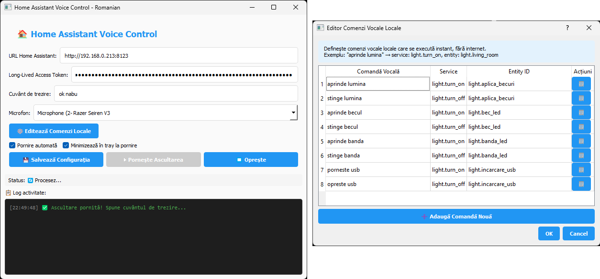

# 🎤 Home Assistant Voice Control

Aplicație desktop pentru controlul vocal al Home Assistant, cu suport pentru wake word, comenzi locale offline și interfață grafică modernă.



## ✨ Caracteristici

### 🎯 Funcționalități Principale

- **Wake Word Detection** - Activare hands-free prin cuvânt cheie personalizabil (implicit: "asistent")
- **Comenzi Locale Offline** - Execuție rapidă fără internet pentru acțiuni frecvente
- **Integrare Home Assistant** - Procesare naturală a comenzilor prin Conversation API
- **Interfață Grafică Modernă** - UI intuitiv construit cu PyQt5
- **System Tray Integration** - Rulare în background cu acces rapid
- **Suport Multi-platformă** - Windows și Linux
- **Auto-start** - Pornire automată cu sistemul de operare
- **Feedback Vizual** - Popup central "Ascult..." cu animații

### 🔧 Funcționalități Tehnice

- Recunoaștere vocală continuă în background
- Editor grafic pentru comenzi locale
- Selecție dispozitiv audio (microfon)
- Logging detaliat cu timestamp și coduri de culoare
- Salvare automată a configurației
- Suport pentru multiple dispozitive audio

## 📋 Cerințe

### Sistem

- Python 3.7+
- Windows 10/11 sau Linux (Ubuntu, Debian, Fedora, etc.)
- Microfon funcțional
- Conexiune la Home Assistant

### Dependințe Python

```
PyQt5
numpy
sounddevice
SpeechRecognition
requests
pyaudio  # Pentru SpeechRecognition
```

## 🚀 Instalare

### 1. Clonare Repository

```bash
git clone https://https://github.com/Zuzzica/Home-Assitant-Voice-Control.git
cd Home-Assitant-Voice-Control
```

### 2. Instalare Dependințe

#### Windows

```bash
pip install PyQt5 numpy sounddevice SpeechRecognition requests pyaudio
```

#### Linux (Ubuntu/Debian)

```bash
# Instalare dependințe sistem
sudo apt-get update
sudo apt-get install python3-pyqt5 portaudio19-dev python3-dev

# Instalare pachete Python
pip install numpy sounddevice SpeechRecognition requests pyaudio
```

### 3. Configurare Home Assistant

1. Accesați Home Assistant
2. Navigați la **Settings** → **Users** → **Long-Lived Access Tokens**
3. Creați un token nou și copiați-l

## ⚙️ Configurare

### Prima Pornire

1. Rulați aplicația:
```bash
python home_assistant_voice_v3_modified.py
```

2. Completați câmpurile obligatorii:
   - **URL Home Assistant**: `http://192.168.1.100:8123` (exemplu)
   - **Token API**: Token-ul generat anterior
   - **Wake Word**: `asistent` (sau alt cuvânt dorit)

3. Selectați dispozitivul audio (microfonul)

4. Apăsați **💾 Salvează Config**

### Configurarea Comenzilor Locale

Comenzile locale se execută instant, fără a trimite request către Home Assistant:

1. Click pe **⚙️ Configurare Comenzi Locale**
2. Click pe **➕ Adaugă Comandă Nouă**
3. Completați:
   - **Comandă Vocală**: `aprinde lumina` (ce spui)
   - **Service**: `light.turn_on` (service Home Assistant)
   - **Entity ID**: `light.living_room` (entitatea vizată)
4. Repetați pentru toate comenzile dorite
5. Click **OK** → **💾 Salvează Config**

#### Exemple de Comenzi Locale

| Comandă Vocală | Service | Entity ID |
|----------------|---------|-----------|
| aprinde lumina | light.turn_on | light.living_room |
| stinge lumina | light.turn_off | light.living_room |
| pornește ventilatorul | fan.turn_on | fan.bedroom |
| oprește ventilatorul | fan.turn_off | fan.bedroom |
| închide jaluzelele | cover.close_cover | cover.living_room |
| deschide jaluzelele | cover.open_cover | cover.living_room |

## 🎮 Utilizare

### Pornire și Oprire

1. **Pornire**: Click pe **▶️ Pornește**
2. **Oprire**: Click pe **⏹️ Oprește**

### Comandă Vocală

#### Mod Wake Word (Recomandat)

1. Spuneți wake word-ul: `"Asistent"` (sau cuvântul configurat)
2. Așteptați popup-ul **"🎤 Ascult..."**
3. Spuneți comanda: `"Aprinde lumina în living"`
4. Aplicația procesează automat

### Flux de Procesare

```
Wake Word → Recunoaștere → Verificare comenzi locale → 
                           ↓ (dacă e locală)           ↓ (dacă nu e locală)
                    Execuție directă            Home Assistant API
```

### System Tray

- **Click stânga**: Arată/ascunde fereastra
- **Click dreapta**: Meniu contextual
  - Arată fereastra
  - Pornește/oprește recunoaștere
  - Ieșire

## 📁 Structură Fișiere

```
.
├── home_assistant_voice_v3_modified.py  # Aplicația principală
├── ha_voice_config.json                 # Configurație salvată (generat automat)
└── README.md                            # Acest fișier
```

## 🛠️ Funcționalități Avansate

### Autostart

Bifați **□ Pornire automată cu sistemul** și salvați configurația.

**Windows**: Adaugă intrare în Registry (HKCU\Software\Microsoft\Windows\CurrentVersion\Run)  
**Linux**: Creează fișier `.desktop` în `~/.config/autostart/`

### Minimize to Tray

Bifați **□ Minimizează în tray la pornire** pentru a rula ascuns de la început.

### Logging

Log-ul afișează:
- 🎤 Wake word detectat
- 👂 Text recunoscut
- ⚡ Comenzi locale executate
- ✅ Răspunsuri Home Assistant
- ❌ Erori și probleme

Fiecare intrare are timestamp și culoare specifică pentru identificare rapidă.

## 🐛 Depanare

### Microfonul nu funcționează

1. Verificați lista de dispozitive în dropdown
2. Testați microfonul în alte aplicații
3. Linux: `arecord -l` pentru a lista dispozitivele
4. Windows: Settings → Sound → Input

### Wake Word-ul nu se detectează

- Vorbiți clar și natural
- Evitați zgomotul de fundal excesiv
- Încercați să schimbați wake word-ul cu unul mai distinct
- Verificați nivelul microfonului (nu prea scăzut)

### Erori de conexiune Home Assistant

```
❌ Eroare HTTP 401 → Token invalid, regenerați token-ul
❌ Eroare HTTP 404 → URL-ul este incorect
❌ Connection refused → Home Assistant nu este accesibil
```

### Comenzile locale nu funcționează

1. Verificați sintaxa service-ului: `domain.service` (ex: `light.turn_on`)
2. Verificați că entity_id există în Home Assistant
3. Testați manual în Developer Tools → Services

## 🔒 Securitate

- **Token-ul API** este salvat în `ha_voice_config.json` în plain text
- Aplicați permisiuni restrictive fișierului:
  ```bash
  chmod 600 ha_voice_config.json  # Linux
  ```
- Nu partajați fișierul de configurație
- Folosiți rețele sigure pentru conexiunea la Home Assistant

## 🤝 Contribuții

Contribuțiile sunt binevenite! Pentru modificări majore:

1. Faceți fork la repository
2. Creați un branch pentru feature (`git checkout -b feature/AmazingFeature`)
3. Commit changes (`git commit -m 'Add some AmazingFeature'`)
4. Push la branch (`git push origin feature/AmazingFeature`)
5. Deschideți un Pull Request

## 📝 Licență

Acest proiect este distribuit sub licența MIT. Vezi fișierul `LICENSE` pentru detalii.

## 🙏 Mulțumiri

- **Home Assistant** - Pentru API-ul Conversation excelent
- **PyQt5** - Pentru framework-ul GUI robust
- **SpeechRecognition** - Pentru biblioteca de recunoaștere vocală

---

**Nota**: Această aplicație necesită o instanță funcțională Home Assistant și un microfon. Recunoașterea vocală folosește Google Speech Recognition (necesită internet pentru comenzi non-locale).
